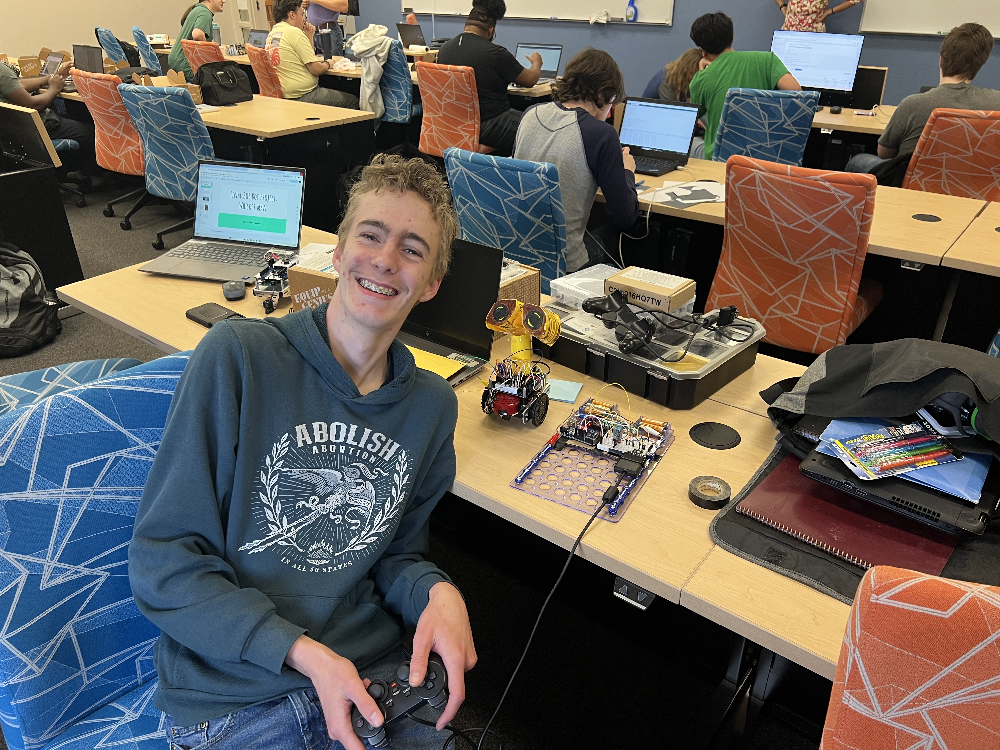

# FinalProject

## Summary
This is the final project for my Intro to Engineering class. It is a remote-controlled, WALL-E inspired robot using the Parallax BoeBot kit. It made WALL-E noises, drove wirelessly controled by a PS2 controller, and responded to its environment.
This was a class project for my EGR-150-AF01 class at College of the Albemarle during the Spring 2026 semester. My professor was Sudeepa Pathak.

## Components
 - Parallax BoeBot chassis, motor, wheels, and battery holder
 - Arduino UNO R3
 - Lots of resistors and Dupont cables
 - Generic Arduino clone
 - Breadboard, power supply
 - HC-05 Bluetooth Modules
 - Winbond 64Mbit SPI flash chip w/ breakout board and header
 - Transistors
 - Snap Circuit Speaker or alternative
 - Aligator clips (for speaker)
 - Laser
 - Decoupling capacitors
 - Electrical tape
 - PS2 controller clone and breadboard breakout connector
 - Whisker switch (I lost the second one, so it could only respond to generic bumps)

## Features & Implementation
On the BoeBot (code: wall-e.ino), I used resistor voltage dividers to connect one of the HC-05 chips to the UART RX port on the Arduino. I used additional resistor voltage dividers to wire up the Winbond SPI flash to the SPI pins, and I wired up a Class D amplifier using the transistors and connected it to the speaker with aligator clips. I connected the laser (using a resistor so I didn't fry the Arduino's pin), and secured everything with duct tape. I connected the whisker switch to a pin and used the internal pullup resistor.

On the control board (code: dashboard.ino), I wired up an Arduino to its power supply and connected an HC-05 chip to the Arduino's TX pins. I wired up the PS2 controller to the Arduino's SPI pins using resistor voltage dividers.

In the wall-e.ino script, I use direct register manipulation for IO, timers, and more. I used a specialized interrupt system to pull a byte from the SPI flash and put it on a custom-configured PWM output. I configured Timer1 to use a 50Hz PWM to control the servos without wasting CPU cycles. It also detected whisker bumps and played a random noise and backed up.

In the dashboard.ino script, I used Bill Porter's legendary PS2X library. I adapted his simple example script to read my specific buttons and output the data over UART.

To link them, I used a custom sliding-window checksummed datatype:data packet structure that seamlessly handled dropped bytes or corrupted bits. This operated over the UART. I used a switch-case statement to read incoming packets on the WALL-E side and respond accordingly by driving, slowing down, playing noises, etc.

## Lessons Learned
This was my first embedded project and my first time stepping away from standard Arduino libraries. It was highly educational. I used bare-metal register manipulation for most IO (I did not get to tackle SPI IO due to deadline limitations), primarily used non-blocking code, learned about the AVR architecture and microarchitecture, manipulated timers, configured PWM, built a zero-overhead Hardware Abstraction Layer (HAL), inspected assembly output in Godbolt Compiler Explorer to confirm that my HAL function calls compiled down to a single line of assembly, and much, much more.

I used AI as a tutor for this project to help me transition to using more C++ features over old-style C, debugging various issues, learning about the AVR architecture and register manipulation, and more. Overall, the project was quite fun and one of the things that has made me decide that I want to be a computer engineer.

I apologize for the lack of schematics and detailed documentation - I pulled this final project out of my previous BoeBot projects almost entirely in one very long day. I am going back now to finish the documentation on it. Please let me know if you have any questions. Here is a picture of me with my final robot:

